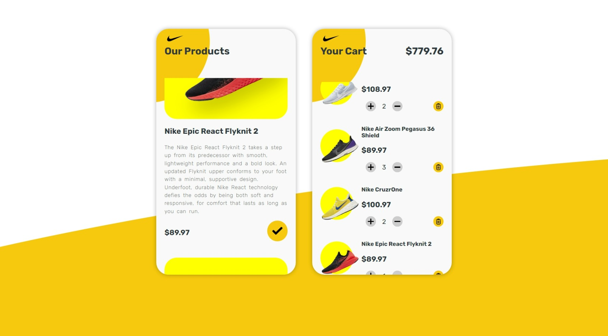

# intern-assignment-golden-owl
### Table of Contents

1. [Describe](#describe)  
2. [Install](#install)
3. [Deploy](#deploy)
4. [Result](#result)
5. [Heroku](#heroku)

### Describe
This is my test result - Tran Van Quang to apply to Golden Owl company for the position of internship
### Install
step 1: clone the repository
```sh
$ git clone https://github.com/tranquanguit/intern-assignment-golden-owl.git
```
step 2: go to the repository
```sh
$ cd intern-assignment-golden-owl
```
step 3: install the packages and libraries
```sh
$ pip install -r requirements.txt -v
```
### Deploy
step 1: run the Flask application
into the repository intern-assignment-golden-owl
```sh
$ python app.py
```
Running on http://127.0.0.1:5000
### Result
This is the result after running the application

### Heroku
